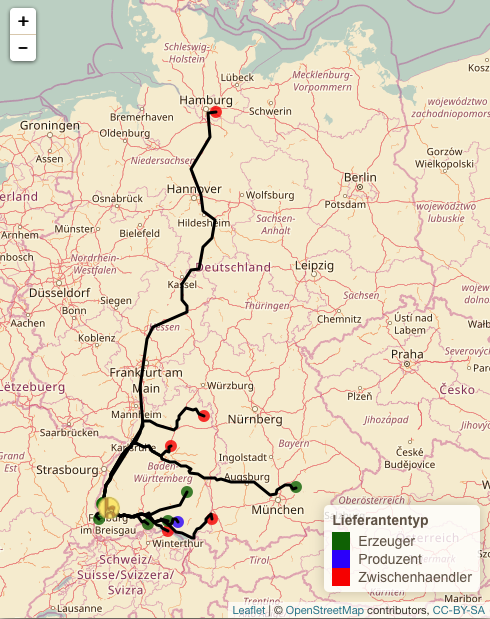

```{r setup, include=FALSE}
knitr::opts_chunk$set(echo = TRUE)
library(ggplot2)
library(RSQLite)
#library(readr)
library(data.table)
library(sf)
library(rgdal)
library(dplyr)
library(raster)
library(tidyr)
library(foodstorage)
library(rgdal)
```

# Introduction

- title: Transport routes of the products of a FoodCoop?

The consumption of food has been identified as one of the most energy demanding activities within a household [@vringer1995]. Historically, patterns of food consumption have changed from locally produced food to a diet where the use of fruits, vegetables or spices from far away regions became common [@carlsson1998]. Also the number of stakeholders involved in food production decreased. The majority of food consumed today passes through a complex, indirect network of a few large, centralized producers, processors, transporters and distributors [@hill2008].

The “buylocal” food movement tries to reverse this trend and argues that locally produced food is not only fresher, richer in vitamins and better tasting, but also better for the environment due to shorter distances of transportation and less energy usage during production and transport [@grebitus2013]. The shorter distances food travels, the less fossil fuels are required for transport and the fewer greenhouse gases are emitted [@hill2008].Another advantage of locally produced food is the improvement of the economic situation of (especially small scale) farmers as they are able to reap a greater profit by the removement of brokers from the distribution chain [@hill2008]. However, several studies have questioned the economic benefits of local foods by stating that buying locally unaware of economic laws and principles is promoting a future characterized by less food security [e.g. @desrochers2012]. Other authors identified some shortcomings that emerge from relying solely on economic logic - for example the focus on efficiency (making the pie bigger) rather than distribution (dividing up the pie fairly) [@scharber2016]. All in all the idea of buying food directly from farmers and thereby shortening the transportation distance seems convincing. Therefore, the popularity of forming consumer cooperatives (so called foodcoops) has grown rapidly since the 1970s [@marion1975]. 

A foodcoop is the combination of people and households for joint shopping. The idea behind this is to collect large quantities of food directly from the producers, making it worthwhile for farmers to drive into the middle of a city. The same principle can be applied to organic foods from wholesalers.As a result members of a foodcoop can usually shop at a lower price than buying in retail stores. Also packaging of products can be avoided by ordering food in bulk and refilling it to reusable packagings. The foodcoops usually work by means of unpaid distributed work and collective administration [@foodcoopedia].

Such foodcoop were founded in Freiburg as well resulting in five existing foodcoops at the moment. The foodcoop "Kornkammer" was founded in 2015 and comprises about 50 households with more or less 100 members. The members decide together what kind of products they want to order, communicate with the producers and store the deliveries in a room where all members can purchase small quantities of the groceries.

This study tries to investigate the transport distances of the products consumed by the foodcoop "Kornkammer" and to inform the foodcoop members about the routes their food travels. 

# Methods
## data acquisition 
  -schon vorhandene daten: produkte, lieferanten und umsätze
  - name of country only coordinates of center(geocode funktion), unsicherheiten kategorisiert...
  -define produzent, zwischenhändler...

  - the accuracy of the origin of the products is described with 3 levels: 
    1 = origin exactly known (with adress)
    2 = region or country of product origin known
    3 = information about origin not available, therefore only a guess of origin


## data processing
- Distanzen berechnen (in die finale totalDistances table) function spDist
- create points and Lines SpatialPointsDataFrame and SpatialLinesdataFrames that contain attributes of products and transport path information bzw. origin/supplier/FoodCoop locations
>>>>>>> 8ec2eae04a2845920d491a0cfd78aad716371fc2
- explain R-function we wrote (??)
- ? workflow : wie readme

## data visualisation
- leaflet-maps
- ggplots
shiny-app !


# Results
```{r, message=FALSE, warning=FALSE, include=FALSE}
producersInfoStraight <- readOGR("../../data/producersInfoStraight/", "producersInfoStraight")
producersInfo <- readOGR("../../data/producersInfo/", "producersInfo")
producersRoutes <- readOGR("../../data/producersRoutes/", "producersRoutes")
producersExist <- readOGR("../../data/producersExist/", "producersExist")
Kornkammer <- readOGR("../../data/Kornkammer/", "Kornkammer")

```


For every product that has ever been ordered by the FoodCoop, the transportation route to the last transfer point, can always be calculated. For a product that is ordered directly from the farmer, the last transfer point equals to its origin. Figure ... : 
{width=250px}
shows the actual driving directions for all products from its last transfer point. 

```{r, eval=FALSE, message=FALSE, warning=FALSE, include=FALSE}
library(leaflet)

pal <- colorFactor(c("darkgreen", "blue", "red"), domain = c(  "Erzeuger", "Produzent", "Zwischenhaendler"))
KKIcon <- iconList(
  Kornkammer = makeIcon("../../data/icon-2.png", "../../data/icon-2.png", 24, 24)
)

leaflet(producersExist) %>%
  addTiles() %>%
  addCircleMarkers(radius = 6,
                   stroke = FALSE, fillOpacity = 0.8, color=pal(producersExist$Lfrntnt),
                   popup = producersExist$Liefrnt) %>%  #, clusterOptions = markerClusterOptions()
  addLegend("bottomright",
            pal = pal, values = ~producersExist$Lfrntnt,
            title = "Lieferantentyp",
            opacity = 1
  ) %>%
  addMarkers(Kornkammer,
             lng = coordinates(Kornkammer)[1], lat = coordinates(Kornkammer)[2],
             icon =  ~KKIcon[Kornkammer$Name],
             popup= "Kornkammer") %>% 
  addPolylines(data = producersRoutes, color = "black", opacity = 1, weight = 2)

```

For those products, that didn't grow at its last transfer point, the distance from its last transfer poit to its origin can be calculated, in the case that its origin is known.

```{r, echo=FALSE, message=FALSE, warning=FALSE, fig.cap="The average turnover of kg per year of every product and the total Distance the product has been transported from its origin to the FoodCoop"}
totalDistances <- read.csv2("../../data/totalDistances.csv")
totalDistances$Herkunftsgenauigkeit[which(totalDistances$Lieferantentyp=="Erzeuger")] <- 1
totalDistances$Herkunftsgenauigkeit <- as.factor(totalDistances$Herkunftsgenauigkeit)
ggplot(totalDistances, aes(Gesamtentfernung, avg.turnover, color = Herkunftsgenauigkeit)) + 
  geom_point() +
  xlab("total Distance [km]") + ylab("average turnover per year [kg]") +
  guides(color=guide_legend(title="Accuracy of origin"))

```

- statistics of distances
- statistics of quantities

- plots 
- maps


# Discussion

- uncertainties of data acquisition
- missing data
- transportation of seeds and seedlings/manure/etc. not included
very few studies have analyzed transportation
upstream of the farm (e.g., transport of farm equipment and
supplies to the farm), which may be important for life-cycle
GHG emissions.


Thus, transportation may be one of the main targets when a conventional energy analysis
is used, but not when greenhouse gas emissions from all sources are accounted for. When
a conventional energy analysis is used for food, important emissions which affect the climate
are not included. This may lead to a sub-optimisation of pollution control.

There is some debate on the extent
to which buying products based solely on the criteria of miles trav-
eled is actually a good indicator of environmental impact, given that
many studies show that distance traveled is actually a poor indicator
of total environmental impact (e.g., see Coley et al., 2009; Mason
et al., 2002; Teisl, 2011).

- further analytics

- some products from suppliers come even from sub-suppliers, who get the products form its real origin! (e.g. some products from OBEG are from BYODO)

## Conclusion

## References


